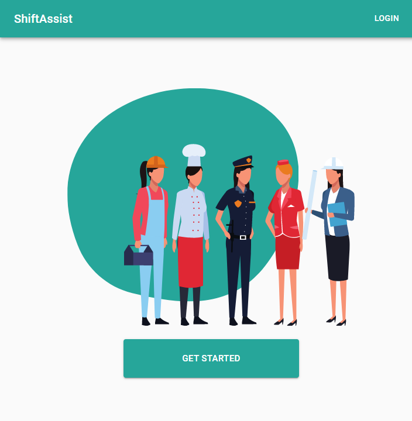
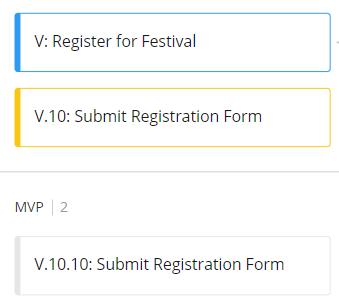
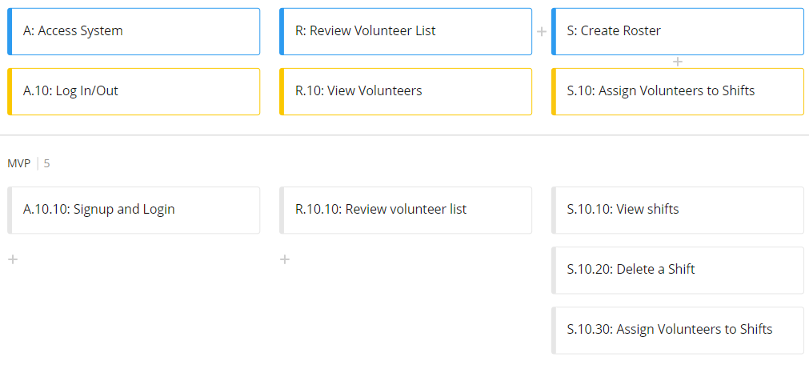
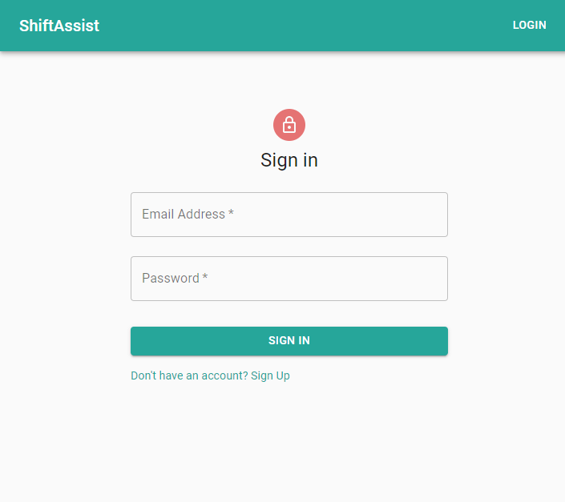
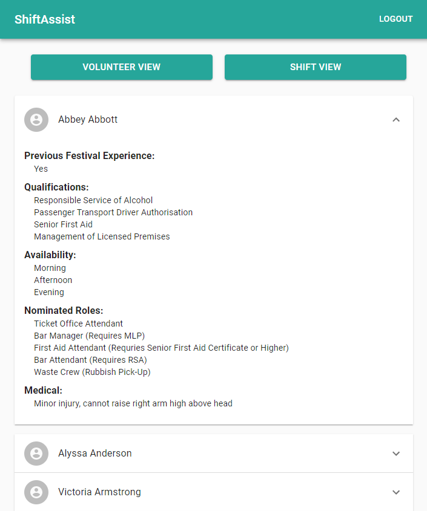
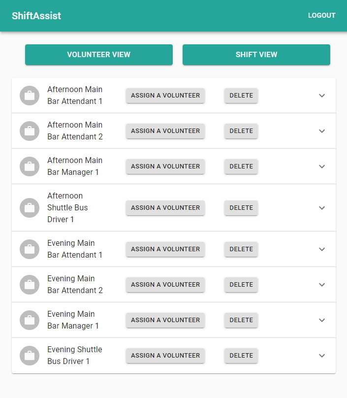
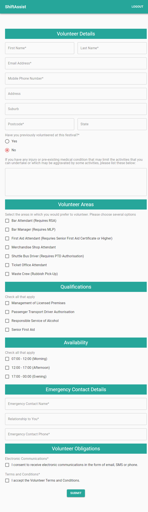

# shift-assist

## Table of Contents

-   [Project Outline](#project-outline)
-   [User Story Map](#user-story-map)
-   [Technology Used](#technology-used)
-   [Design Notes](#design-notes)
-   [Links](#links)
-   [Credits And Thanks](#credits-and-thanks)
-   [Contributing](#contributing)
-   [Questions](#questions)
-   [Screenshots of Deployed Application](#screenshots-of-deployed-application)

## Project Outline

ShiftAssist is a tool designed to significantly reduce the time and effort required to construct a volunteer roster for large-scale events like music festivals. 
- Accepts Volunteer registrations
- Displays Volunteer and shift data
- Used to assign Volunteers to shifts

## User Story Map

### Volunteer

### Admin/Volunteer Coordinator 

## Technology Used

### MERN stack

* [MongoDB](https://www.mongodb.com/)
* [Express](https://www.npmjs.com/package/express)
* [React](https://reactjs.org/)
* [Node.js](https://nodejs.org/en/docs/)

### Object Data Modelling (ODM)
* [Mongoose](https://mongoosejs.com/)

### GraphQL Platform
* [Apollo GraphQL](https://www.apollographql.com/docs/)

### React Frameworks and Libraries
* [Material-UI](https://material-ui.com/)
* [Formik](https://www.npmjs.com/package/faker)

### Data Validation
* [Yup](https://www.npmjs.com/package/yup)

### Authentication
* [JSON Web Token (JWT) via jasonwebtoken package](https://www.npmjs.com/package/jsonwebtoken)
* [BCrypt](https://www.npmjs.com/package/bcrypt)

### Deployment
* [Heroku](https://devcenter.heroku.com/categories/reference)

### Other
* [faker.js](https://www.npmjs.com/package/faker)

## Design Notes

* Formik was used with Material-UI to create the Volunteer Registration Form, and the Yup npm package was used for form data validation
* faker.js was used to populate example data (none of the volunteer data in the deployed application contains authentic personal information)

## Links

[Deployed Application](https://shift-assist.herokuapp.com/)

[Github Repository](https://github.com/stephje/shift-assist)

[Presentation Slides](https://docs.google.com/presentation/d/1yqEJlsQ6-rPVOs5atAzOubgn7IM0dIabPAkM2MBWmBE/edit?usp=sharing)

## Credits and Thanks

[SimpleTut's guide](https://www.youtube.com/watch?v=MV9NC3FoCmM&ab_channel=SimpleTut) on creating forms with Formik and Material-UI (YouTube) was used as a reference for the volunteer registration form. 

## Contributing

To contribute to this project, please reach out to the creator via email (contact details below).

## Questions

For any questions pertaining to this project, the developer can be reached via any of the contact methods listed below.
Please ensure that you include the name of this project ("ShiftAssist") or repository ("shift-assist") in any communications.

-   [GitHub](https://github.com/stephje)
-   [Email](mailto:s.jenkins3018@gmail.com)

## Screenshots of Deployed Application

### Sign In Page

### Administrator View

### Volunteer Registration Form

